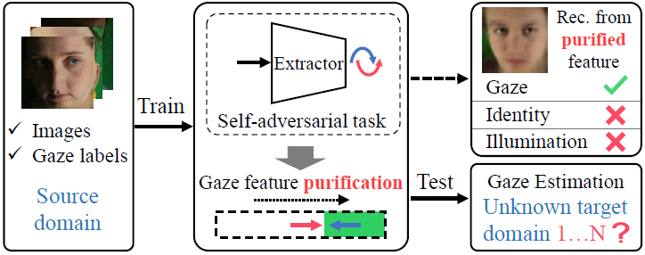
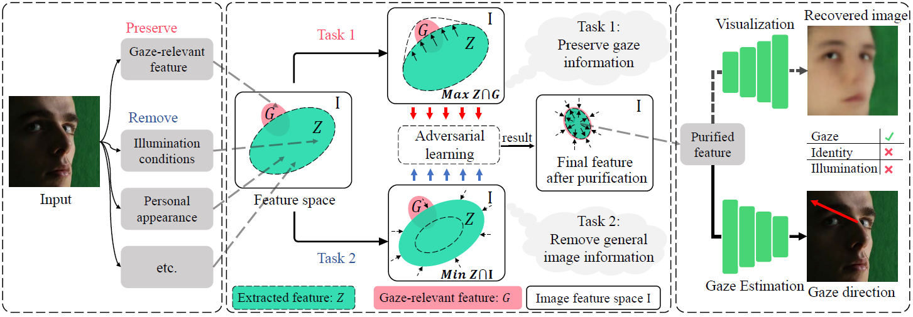
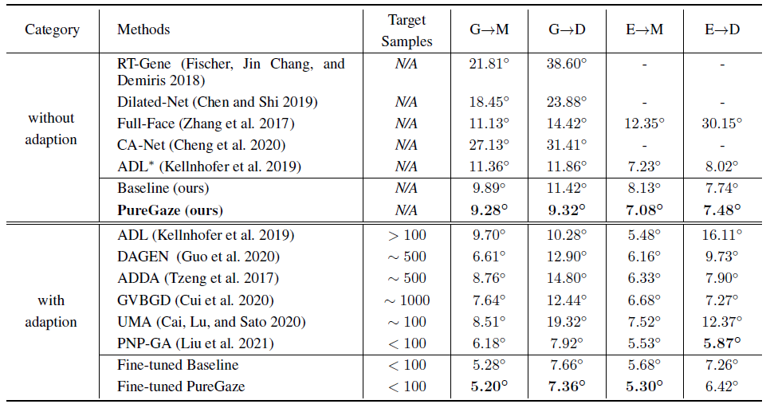
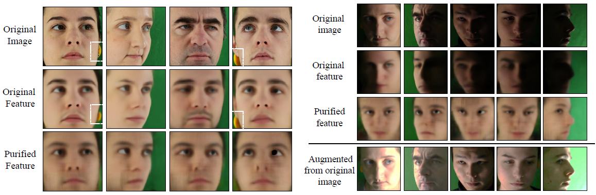

# PureGaze: Purifying Gaze Feature for Generalizable Gaze Estimation (Updating...)

## Description 

Our work is accpeted by **AAAI 2022**.

   

**Picture:** We propose a domain-generalization framework for gaze estimation. 
Our method is only trained in the source domain and brings improvement in *all unknown target domains*.
The key idea of our method is to purify the gaze feature with a self-adversarial framework.

   
  

**Picture:** Overview of the gaze feature purification. Our goal is to preserve the gaze-relevant feature and eliminate gaze-irrelevant
features. We define two tasks, which are to preserve gaze information and to remove general facial image
information. The two tasks are not cooperative but adversarial to purify feature. Simultaneously optimizing the two tasks, we
implicitly purify the gaze feature without defining gaze-irrelevant feature.

   

**Performance:** PureGaze shows best performance among typical gaze estimation methods (w/o adaption), and has competitive result among domain adaption methods. Note that, PureGaze learns one optimal model for four tasks, while domain adaption methods need to learn a total of four models. This is an advantage of PureGaze.

   

**Feature visualization:** The result clearly explains the purification. Our purified feature contains less gaze-irrelevant feature and naturally improves the cross-domain performance.

## Requirement
We build the project with   `pytorch1.7.0`.

